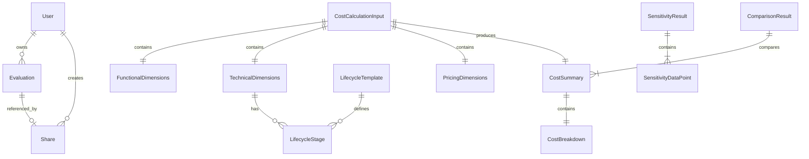

# Data Model: IPC Case Cost Evaluator

**Date**: 2026-01-25
**Status**: Complete

## Entity Relationship Diagram



## Core Entities

### 1. FunctionalDimensions (功能维度)

描述监控场景的业务参数。

| Field | Type | Constraints | Description |
|-------|------|-------------|-------------|
| device_count | int | ge=1, le=100000 | 设备数量 |
| recording_mode | RecordingMode | enum | 录像模式 |
| video_quality | VideoQuality | enum | 视频质量 |
| events_per_day | int | ge=0, le=1000 | 每日事件数 (事件触发模式) |
| event_duration_seconds | int | ge=1, le=3600 | 事件时长秒数 |
| access_pattern | float | ge=0, le=1 | 回看比例 (0-100%) |
| retention_days | int | ge=1, le=365 | 保留天数 |
| segment_strategy | SegmentStrategy | enum | 分片策略 |
| segment_seconds | int | ge=10, le=300 | 固定时长分片秒数 |
| segment_mb | int | ge=1, le=100 | 固定大小分片 MB |

**Enums**:
```python
class RecordingMode(str, Enum):
    CONTINUOUS = "continuous"        # 24x7 连续录像
    EVENT_TRIGGERED = "event"        # 事件触发录像
    SCHEDULED = "scheduled"          # 计划录像

class VideoQuality(str, Enum):
    HD_720P = "720p"     # data_rate_kb = 125
    FHD_1080P = "1080p"  # data_rate_kb = 250
    QHD_2K = "2k"        # data_rate_kb = 500
    UHD_4K = "4k"        # data_rate_kb = 1200

class SegmentStrategy(str, Enum):
    FIXED_DURATION = "fixed_duration"  # 固定时长
    FIXED_SIZE = "fixed_size"          # 固定大小
    REALTIME_STREAM = "realtime"       # 实时流
```

---

### 2. TechnicalDimensions (技术维度)

描述存储技术选型参数。

| Field | Type | Constraints | Description |
|-------|------|-------------|-------------|
| storage_class | StorageClass | enum | 存储类型 |
| lifecycle_enabled | bool | default=False | 是否启用生命周期 |
| lifecycle_stages | list[LifecycleStage] | max_length=5 | 生命周期阶段列表 |

**Enum**:
```python
class StorageClass(str, Enum):
    STANDARD = "STANDARD"
    GLACIER_IR = "GLACIER_IR"
    DEEP_ARCHIVE = "DEEP_ARCHIVE"
```

---

### 3. LifecycleStage (生命周期阶段)

描述单个存储周期阶段。

| Field | Type | Constraints | Description |
|-------|------|-------------|-------------|
| name | str | max_length=50 | 阶段名称 |
| storage_class | StorageClass | enum | 存储类型 |
| days | int | ge=1, le=365 | 持续天数 |
| start_day | int | ge=0, computed | 起始天 (计算字段) |

**Validation Rules**:
- 阶段必须连续，无间隙
- 阶段总天数必须等于 retention_days
- 存储类型必须按成本递减顺序 (Standard → Glacier IR → Deep Archive)

---

### 4. LifecycleTemplate (生命周期模板)

描述预设的生命周期策略模板。

| Field | Type | Constraints | Description |
|-------|------|-------------|-------------|
| id | str | unique | 模板标识 |
| name | str | max_length=100 | 模板名称 |
| description | str | max_length=500 | 模板描述 |
| total_days | int | ge=1 | 总天数 |
| stages | list[LifecycleStage] | min_length=2 | 阶段配置列表 |

**Predefined Templates**:
- `short_30_days`: 短期 30 天
- `medium_90_days`: 中期 90 天
- `long_365_days`: 长期 365 天

---

### 5. PricingDimensions (价格维度)

描述定价相关配置。

| Field | Type | Constraints | Description |
|-------|------|-------------|-------------|
| region | str | AWS region code | AWS 区域 |
| discount_rate | float | ge=0, le=0.5 | 企业折扣比例 |
| billing_mode | BillingMode | enum | 计费模式 |

---

### 6. CostCalculationInput (成本计算输入)

组合三维度作为计算器输入。

| Field | Type | Description |
|-------|------|-------------|
| functional | FunctionalDimensions | 功能维度 |
| technical | TechnicalDimensions | 技术维度 |
| pricing | PricingDimensions | 价格维度 |

---

### 7. CostBreakdown (费用明细)

描述单个方案的成本构成。

| Field | Type | Unit | Description |
|-------|------|------|-------------|
| storage_cost | float | USD | 存储费用 |
| put_request_cost | float | USD | PUT 请求费用 |
| get_request_cost | float | USD | GET 请求费用 |
| retrieval_cost | float | USD | 数据检索费用 |
| transfer_cost | float | USD | 数据传输费用 |
| lifecycle_transition_cost | float | USD | 生命周期转换费用 |

**Computed Field**:
```python
@computed_field
def total(self) -> float:
    return sum([
        self.storage_cost,
        self.put_request_cost,
        self.get_request_cost,
        self.retrieval_cost,
        self.transfer_cost,
        self.lifecycle_transition_cost
    ])
```

---

### 8. CostSummary (成本汇总)

描述计算结果。

| Field | Type | Description |
|-------|------|-------------|
| storage_class | StorageClass | 存储类型 |
| breakdown | CostBreakdown | 费用明细 |
| monthly_total | float | 月度总成本 |
| yearly_total | float | 年度总成本 |
| metrics | CalculationMetrics | 中间计算指标 |

**CalculationMetrics**:
```python
class CalculationMetrics(BaseModel):
    daily_data_gb: float       # 每日数据量 GB
    monthly_storage_gb: float  # 月度存储量 GB
    monthly_puts: int          # 月度 PUT 请求数
    monthly_gets: int          # 月度 GET 请求数
    monthly_retrieval_gb: float # 月度检索量 GB
```

---

### 9. ComparisonResult (对比结果)

描述多方案对比结果。

| Field | Type | Description |
|-------|------|-------------|
| scenarios | list[CostSummary] | 各方案成本汇总 |
| recommended | str | 推荐方案标识 |
| recommendation_reason | str | 推荐理由 |
| savings_vs_standard | dict[str, float] | 相对 Standard 的节省比例 |

---

### 10. SensitivityResult (敏感度分析结果)

描述参数变化对成本的影响。

| Field | Type | Description |
|-------|------|-------------|
| param_name | str | 参数名称 |
| base_value | float | 基准值 |
| data_points | list[SensitivityDataPoint] | 数据点列表 |

**SensitivityDataPoint**:
```python
class SensitivityDataPoint(BaseModel):
    factor: float              # 倍数因子 (0.5 ~ 2.0)
    param_value: float         # 参数值
    monthly_cost: float        # 月度成本
    cost_change_percent: float # 成本变化百分比
```

---

### 11. Evaluation (评估记录)

描述用户保存的评估。

| Field | Type | Constraints | Description |
|-------|------|-------------|-------------|
| evaluation_id | str | UUID | 评估 ID |
| user_id | str | UUID | 用户 ID |
| name | str | max_length=200 | 评估名称 |
| input_params | CostCalculationInput | - | 输入参数快照 |
| result | CostSummary | - | 计算结果快照 |
| comparison | ComparisonResult | optional | 对比结果 |
| created_at | datetime | - | 创建时间 |
| updated_at | datetime | - | 更新时间 |

**DynamoDB Key Schema**:
- PK: `user_id`
- SK: `evaluation_id`

---

### 12. Share (分享链接)

描述评估分享记录。

| Field | Type | Constraints | Description |
|-------|------|-------------|-------------|
| share_id | str | UUID | 分享 ID |
| user_id | str | UUID | 创建者用户 ID |
| evaluation_snapshot | dict | - | 评估数据快照 |
| created_at | datetime | - | 创建时间 |
| expires_at | datetime | TTL | 过期时间 (默认 7 天) |

**DynamoDB Key Schema**:
- PK: `share_id`
- TTL: `expires_at` (自动过期删除)

---

### 13. User (用户)

描述系统用户。

| Field | Type | Constraints | Description |
|-------|------|-------------|-------------|
| user_id | str | UUID | 用户 ID |
| email | str | unique, email format | 邮箱 |
| password_hash | str | - | 密码哈希 (bcrypt) |
| created_at | datetime | - | 注册时间 |
| last_login | datetime | optional | 最后登录时间 |

**DynamoDB Key Schema**:
- PK: `user_id`
- GSI: `email-index` (email → user_id)

---

### 14. RegionalPricing (区域定价)

描述特定 AWS 区域的定价数据。

| Field | Type | Description |
|-------|------|-------------|
| region | str | AWS 区域代码 |
| storage_prices | dict[StorageClass, float] | 存储单价 ($/GB/月) |
| put_request_prices | dict[StorageClass, float] | PUT 请求单价 ($/千次) |
| get_request_prices | dict[StorageClass, float] | GET 请求单价 ($/千次) |
| retrieval_prices | dict[StorageClass, float] | 检索单价 ($/GB) |
| lifecycle_transition_prices | dict[StorageClass, float] | 转换单价 ($/千次) |
| data_transfer_price | float | 数据传输单价 ($/GB) |
| last_updated | datetime | 最后更新时间 |

---

### 15. Scenario (预设场景)

描述预设的典型监控场景。

| Field | Type | Description |
|-------|------|-------------|
| id | str | 场景标识 |
| name | str | 场景名称 |
| description | str | 场景描述 |
| params | FunctionalDimensions | 预设参数 |

**Predefined Scenarios**:
1. `small_store`: 小型门店监控 (10 台 720p)
2. `medium_office`: 中型办公楼监控 (50 台 1080p)
3. `large_campus`: 大型园区监控 (200 台 1080p)
4. `high_security`: 高安全场所监控 (100 台 4K)
5. `retail_chain`: 连锁零售监控 (500 台 1080p)

---

## State Transitions

### Evaluation Lifecycle

```
[New] → [Saved] → [Updated] → [Deleted]
                ↓
            [Shared] → [Share Expired]
```

### Share Lifecycle

```
[Created] → [Active] → [Expired (TTL)]
```

---

## Validation Summary

| Entity | Validation Rule |
|--------|-----------------|
| FunctionalDimensions | device_count >= 1, retention_days 1-365 |
| LifecycleStage | 阶段连续性，天数总和 = retention_days |
| PricingDimensions | discount_rate 0-50% |
| User | email 唯一性，密码强度 |
| Share | expires_at > created_at |
