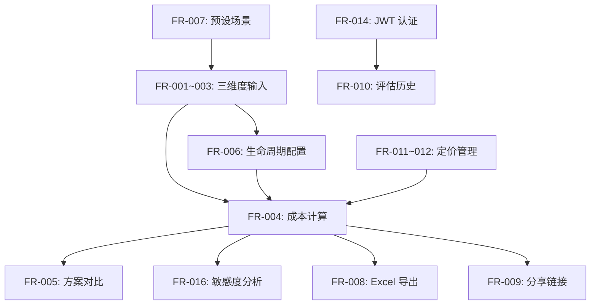

# Implementation Plan: IPC Case Cost Evaluator

**Branch**: `001-ipc-cost-evaluator` | **Date**: 2026-01-25 | **Spec**: [spec.md](./spec.md)
**Input**: Feature specification from `/specs/001-ipc-cost-evaluator/spec.md`

## Summary

构建一个完整的 AWS S3 云存储成本评估系统，支持 IPC 监控场景的成本计算、多方案对比、生命周期策略配置、敏感度分析，以及结果导出与分享功能。系统采用 FastAPI + React + DynamoDB 技术栈，遵循三维度模型设计原则。

## Technical Context

**Language/Version**: Python 3.11+ (Backend), TypeScript 5.9+ (Frontend)
**Primary Dependencies**:
- Backend: FastAPI 0.109+, Pydantic 2.5+, boto3 1.34+, python-jose, openpyxl
- Frontend: React 19, Ant Design 6.x, @ant-design/charts, TanStack Query 5.x

**Storage**: Amazon DynamoDB (评估历史、分享链接)，本地 JSON (AWS 定价数据)
**Testing**: pytest 8.0+ (Backend), Playwright (E2E)
**Target Platform**: Web (Desktop/Tablet)，AWS 部署环境
**Project Type**: Web Application (frontend + backend)
**Performance Goals**:
- 成本计算响应 < 2s (SC-002)
- 100 并发用户支持 (SC-004)
- 首次计算完成 < 60s (SC-001)

**Constraints**:
- 成本计算与 AWS 官方偏差 < 5% (SC-005)
- JWT Token 认证，Token 有效期可配置
- 支持离线定价数据回退

**Scale/Scope**:
- 8 个用户故事 (P1: 2, P2: 3, P3: 3)
- 16 个功能需求
- 12 个核心实体

## Constitution Check

*GATE: Must pass before Phase 0 research. Re-check after Phase 1 design.*

| Principle | Status | Evidence |
|-----------|--------|----------|
| I. 三维度模型设计 | ✅ PASS | spec.md 定义 FunctionalDimensions, TechnicalDimensions, PricingDimensions |
| II. 计算器继承体系 | ✅ PASS | 现有 BaseCalculator + S3StandardCalculator 结构已实现 |
| III. Pydantic 数据模型优先 | ✅ PASS | 所有模型使用 Pydantic，枚举包含业务常量 |
| IV. 测试驱动验证 | ⚠️ PARTIAL | 需补充敏感度分析、生命周期模板的测试用例 |
| V. 定价数据外部化 | ✅ PASS | 定价数据在 aws_pricing/*.json，支持 AWS API 刷新 |

**Gate Result**: ✅ PASS (可进入 Phase 0)

## Project Structure

### Documentation (this feature)

```text
specs/001-ipc-cost-evaluator/
├── spec.md              # 功能规格 (已完成)
├── plan.md              # 本文件
├── research.md          # Phase 0 输出
├── data-model.md        # Phase 1 输出
├── quickstart.md        # Phase 1 输出
├── contracts/           # Phase 1 输出 (OpenAPI)
│   └── openapi.yaml
├── checklists/          # 检查清单
│   └── ux.md
└── tasks.md             # Phase 2 输出 (/speckit.tasks)
```

### Source Code (repository root)

```text
backend/
├── app/
│   ├── api/
│   │   └── routes/
│   │       ├── calculate.py      # 成本计算端点
│   │       ├── compare.py        # 方案对比端点
│   │       ├── scenarios.py      # 预设场景端点
│   │       ├── sensitivity.py    # 敏感度分析端点 [NEW]
│   │       ├── lifecycle.py      # 生命周期配置端点 [NEW]
│   │       ├── export.py         # 导出端点 [NEW]
│   │       ├── share.py          # 分享端点
│   │       ├── evaluations.py    # 评估历史端点
│   │       ├── pricing.py        # 定价管理端点
│   │       └── auth.py           # JWT 认证端点 [NEW]
│   ├── models/
│   │   ├── dimensions.py         # 三维度模型
│   │   ├── enums.py              # 枚举定义
│   │   ├── results.py            # 计算结果模型
│   │   ├── pricing.py            # 定价模型
│   │   ├── share.py              # 分享链接模型
│   │   ├── sensitivity.py        # 敏感度分析模型 [NEW]
│   │   ├── lifecycle.py          # 生命周期模板模型 [NEW]
│   │   └── auth.py               # 认证模型 [NEW]
│   ├── services/
│   │   ├── calculator/
│   │   │   ├── base.py           # 基础计算器
│   │   │   ├── s3_standard.py    # S3 Standard 计算器
│   │   │   ├── s3_glacier.py     # S3 Glacier IR 计算器
│   │   │   └── lifecycle.py      # 生命周期策略计算器
│   │   ├── sensitivity.py        # 敏感度分析服务 [NEW]
│   │   ├── export.py             # Excel 导出服务 [NEW]
│   │   ├── share.py              # 分享链接服务
│   │   ├── pricing_service.py    # 定价服务
│   │   └── auth.py               # JWT 认证服务 [NEW]
│   ├── data/
│   │   ├── aws_pricing/          # AWS 定价 JSON
│   │   ├── scenarios/            # 预设场景 JSON [NEW]
│   │   └── lifecycle_templates/  # 生命周期模板 JSON [NEW]
│   ├── db/
│   │   ├── dynamodb_client.py    # DynamoDB 客户端
│   │   └── repositories/
│   │       ├── evaluations.py    # 评估记录仓库
│   │       ├── shares.py         # 分享链接仓库
│   │       └── users.py          # 用户仓库 [NEW]
│   └── core/
│       └── config.py             # 配置管理
└── tests/
    ├── unit/
    │   ├── test_calculator/
    │   ├── test_sensitivity.py   # [NEW]
    │   └── test_lifecycle.py     # [NEW]
    ├── integration/
    │   └── test_api/
    └── e2e/

frontend/
├── src/
│   ├── components/
│   │   ├── Calculator/           # 计算器组件
│   │   ├── Comparison/           # 对比分析组件
│   │   ├── Sensitivity/          # 敏感度分析组件 [NEW]
│   │   ├── Lifecycle/            # 生命周期编辑器 [NEW]
│   │   ├── Charts/               # 图表组件
│   │   └── common/               # 通用组件
│   ├── pages/
│   │   ├── CalculatorPage.tsx
│   │   ├── HistoryPage.tsx
│   │   ├── SharePage.tsx
│   │   └── AdminPage.tsx         # 定价管理 [NEW]
│   ├── services/
│   │   └── api.ts                # API 客户端
│   ├── hooks/
│   │   └── useCalculation.ts     # 计算 Hook
│   └── types/
│       └── index.ts              # TypeScript 类型
└── tests/
    └── e2e/
        └── *.spec.ts             # Playwright 测试
```

**Structure Decision**: 采用 Web Application 结构 (Option 2)，backend/ 和 frontend/ 分离，符合现有项目布局。

## Complexity Tracking

| Violation | Why Needed | Simpler Alternative Rejected Because |
|-----------|------------|-------------------------------------|
| DynamoDB 存储 | 用户数据持久化、分享链接管理 | LocalStorage 无法跨设备、无法支持分享功能 |
| JWT 认证 | API 安全、评估历史绑定用户 | 无认证方案无法区分用户数据 |

## Implementation Phases

### Phase 0: Research (完成)

见 [research.md](./research.md)

### Phase 1: Design & Contracts (完成)

见 [data-model.md](./data-model.md) 和 [contracts/openapi.yaml](./contracts/openapi.yaml)

### Phase 2: Tasks (待执行)

运行 `/speckit.tasks` 生成任务分解。

## Risk Assessment

| Risk | Impact | Mitigation |
|------|--------|------------|
| AWS Pricing API 不稳定 | 中 | 本地定价数据回退，定期缓存刷新 |
| DynamoDB 冷启动延迟 | 低 | 使用按需容量模式，前端加载提示 |
| 计算精度偏差 | 高 | 单元测试验证与 AWS 官方计算器对比 |
| JWT Token 泄露 | 高 | 短期 Token + Refresh Token 机制 |

## Dependencies



## Next Steps

1. 运行 `/speckit.tasks` 生成详细任务分解
2. 按 P1 → P2 → P3 优先级实现用户故事
3. 每完成一个故事运行对应测试验证
